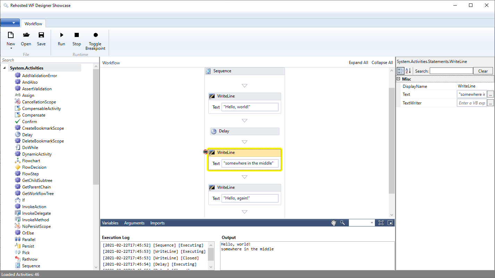

# .NET Rehosted Workflow Designer

The solution contains:

## WPF Desktop Application
* Workflow Designer
  * rehosting in a WPF Application
  * property page editor
  * VB or C# expression editors
* Toolbox Control
  * loading Workflow Activities from Assemblies
* Workflow Execution
  * run Workflows directly inside app
  * retrieve real-time Execution Log (TrackData) and Execution/Console Output(s)
  * highlights currently executing Activity
  * selecting item in Execution Log highlights corresponding Activity
  * Workflow validation errors
  * selecting item in Validation Errors selects corresponding Activity
* Workflow Management
  * New / Open / Save / Run / Stop / Debug / Undo / Redo
  * toggle breakpoint on any Activity

## Custom Activities

* ShowMessageBox - displays in a MessageBox the Value of the InputData argument
* GetGroupMembers - retrieves the Member Names and Count for a specified Meetup.Com Group
* GetRSVPmembers - retrieves the Member Names and Count for a specified Meetup.Com Event

## Demo Workflows

### AzureVmPowerOperations.xaml
* InArguments - VM & Service names
* OutArguments - ActionPerformed
* the workflow connects to Azure & changes the VM power state: if Powered On it will be power off, else powered on

### LocalWinServicesCSV.xaml
* InArguments - Status (default is "running")
* the workflow retrieves the local windows services with the status defined by the inargument, writes the list to a file & opens it

### SvcMonitoring.xaml
* InArguments - Service
* OutArguments - Log
* the state machine workflows monitors the state of the specified windows service; if the state changes, the user gets notified via SMS

### Meetup.xaml
* InArguments - Meetup.COM REST API Key and RSVP (true / false)
* If RSVP = false - the Workflow outputs a list with the Members of a Meetup.Com Group
* If RSVP = true - the Workflow outputs a list with the Attending Members of a Meetup.Com Event

## Links

### Andrei Robert Oros

* [Windows Workflow Foundation and .Net Core](https://andreioros.com/blog/windows-workflow-foundation-net-core/)
* [Windows Workflow Foundation in 2017 (overview)](https://andreioros.com/blog/windows-workflow-foundation-2017/)
* blog post about the WF Designer demo - [Windows Workflow Foundation Rehosted Designer](http://andreioros.com/blog/windows-workflow-foundation-rehosted-designer/)
* WF presentation at Microsoft Summit 2015 [Introduction to Windows Workflow Foundation](http://www.slideshare.net/orosandrei/windows-workflow-foundation-54773529)
* project showcased at [Microsoft Summit 2015](http://andreioros.com/blog/workflow-foundation-microsoft-summit/#more-92) & [Timisoara .NET Meetup 2](http://www.meetup.com/Timisoara-NET-Meetup/events/186254642/)
* Twitter [@orosandrei](http://twitter.com/orosandrei)

### MSDN

* [Kushal Shah](https://docs.microsoft.com/en-us/archive/blogs/kushals/)
* [Windows Workflow Foundation](http://msdn.microsoft.com/en-us/library/dd489441(v=vs.110).aspx)
* [What's new in WF 4.5](https://msdn.microsoft.com/en-us/library/hh305677.aspx)
* [Support for New Workflow Foundation 4.5 Features in the Rehosted Workflow Designer](https://github.com/dotnet/docs/blob/master/docs/framework/windows-workflow-foundation/wf-features-in-the-rehosted-workflow-designer.md)
* [Using the ModelItem Editing Context](https://docs.microsoft.com/en-us/dotnet/framework/windows-workflow-foundation/using-the-modelitem-editing-context)
* [Building C# expressions support and IntelliSense in the rehosted workflow designer](https://docs.microsoft.com/en-gb/archive/blogs/workflowteam/building-c-expressions-support-and-intellisense-in-the-rehosted-workflow-designer)
* [Roslyn C# Expression Editor](https://github.com/dmetzgar/wf-rehost-roslyn)
* [Custom Expression Editor](https://blogs.msdn.microsoft.com/cathyk/2009/11/05/implementing-a-custom-expression-editor/)
* [Expression Editing Mechanics](https://blogs.msdn.microsoft.com/cathyk/2009/11/09/expression-editing-mechanics/)
* [Core Workflow (.net core runtime)](https://github.com/UiPath/corewf)

### Other

* [Avalon Edit](https://github.com/icsharpcode/AvalonEdit)
* [How to add the right-click breakpoints menu to a rehosted workflow designer
](https://stackoverflow.com/questions/25363874/how-to-add-the-right-click-breakpoints-menu-to-a-rehosted-workflow-designer)
* [How to extend the context menu inside the rehosted workflow designer?
](https://stackoverflow.com/questions/35239162/how-to-extend-the-context-menu-inside-the-rehosted-workflow-designer)
* [Workflow Designer Re-Hosting](https://www.c-sharpcorner.com/article/workflow-designer-re-hosting/)
* [Rehosting the Workflow Designer in WF4](https://blogs.msmvps.com/theproblemsolver/2009/12/23/rehosting-the-workflow-designer-in-wf4/)
* [Changing the Icon on a custom activity designer](https://blogs.msmvps.com/theproblemsolver/2010/01/25/changing-the-icon-on-a-custom-activity-designer/)
* [Reskinning built-in workflow activities](https://kevsoft.net/2014/02/28/re-skinning-built-in-wf-activities.html)
* [Workflow Foundation Native activity child activities on designer
](https://stackoverflow.com/questions/16970113/workflow-foundation-native-activity-child-activities-on-designer)
* [Felice Pollano Blog](http://www.felicepollano.com/CategoryView,category,ReHosting.aspx)
* [WF4 Designer Rehosting: get Scoped Variables
](https://adrianot75.wordpress.com/2010/11/23/wf4-designer-rehosting-get-scoped-variables/)

## Miscellaneous

* [Workflow icon](https://www.visualpharm.com/free-icons/workflow-595b40b85ba036ed117dc5ff)

